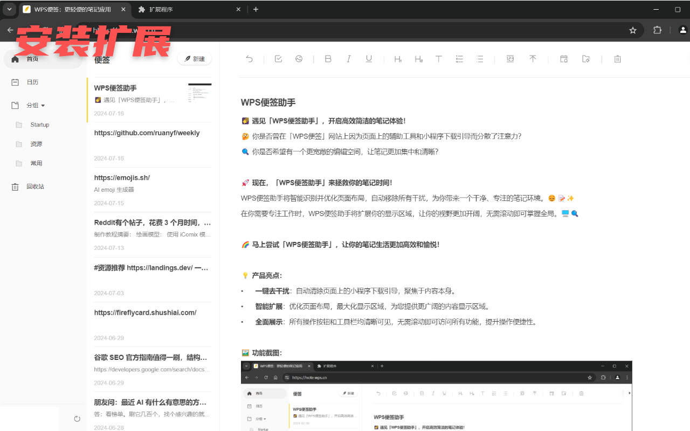
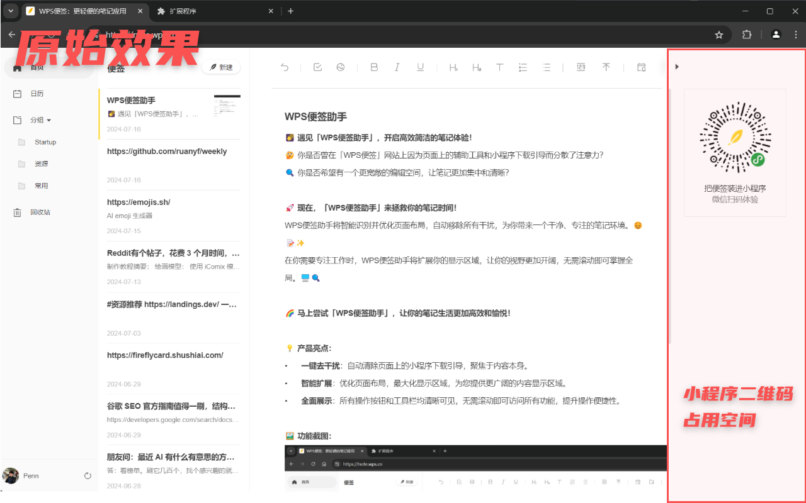

「WPS便签助手」是一款专为提升用户在「[WPS便签](WPS便签助手)」网站上浏览体验而设计的浏览器扩展。它通过智能识别并优化页面布局，为您带来更加清爽、专注的阅读和编辑环境。

**🌠 遇见「WPS便签助手」，开启高效简洁的笔记体验！**

🤔 你是否曾在「WPS便签」网站上因为页面上的辅助工具和小程序下载引导而分散了注意力？

🔍 你是否希望有一个更宽敞的编辑空间，让笔记更加集中和清晰？

**🚀 现在，「WPS便签助手」来拯救你的笔记时间！**

WPS便签助手将智能识别并优化页面布局，自动移除所有干扰，为你带来一个干净、专注的笔记环境。😌📝✨

在你需要专注工作时，WPS便签助手将扩展你的显示区域，让你的视野更加开阔，无需滚动即可掌握全局。🖥️🔍

🌈 马上尝试「WPS便签助手」，让你的笔记生活更加高效和愉悦！

🌐 浏览器扩展下载地址： [Microsoft Edge Add-ons](https://microsoftedge.microsoft.com/addons/detail/ggjghjioanfhdpkhladphbacfmicmiih)
/ [Chrome Web Store](https://chromewebstore.google.com/detail/wps便签助手/comnfhdcnamiakeikahbcbjldhbpmnhi)

----

**💡 产品亮点：**
- **一键去干扰**：自动清除页面上的小程序下载引导，聚焦于内容本身。
- **智能扩展**：优化页面布局，最大化显示区域，提升你的编辑体验。
- **全面展示**：所有操作按钮和工具栏一目了然，提高工作效率。

----

**🖼️ 功能截图：**

安装扩展后的效果：

安装前效果：

